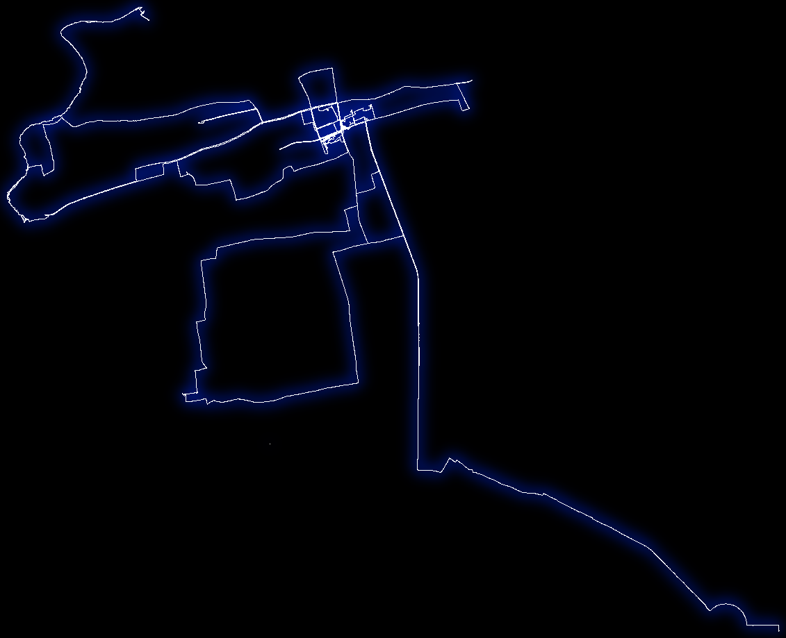
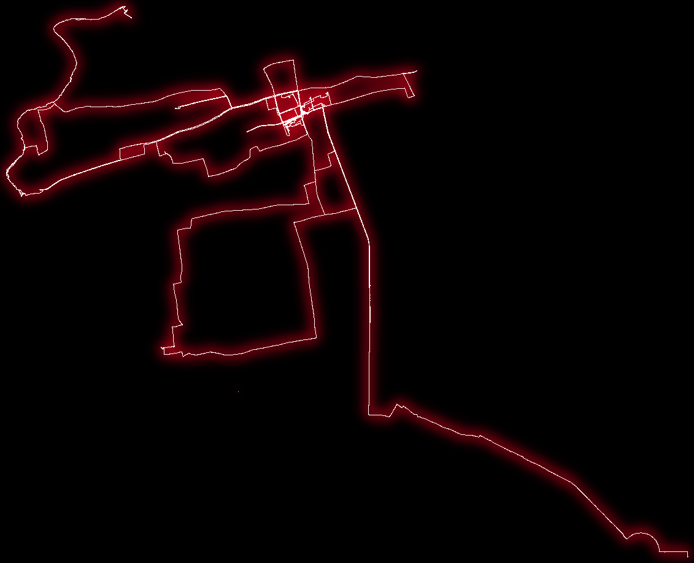

# heatmap

### usage

- 收集所有轨迹文件

```shell
# 国内
python3 garmin_export.py -u 'xxxxx' -p 'xxxx' --is-cn
# 国际
python3 garmin_export.py -u 'xxxxx' -p 'xxxx'
```

- run gps_scripts

```shell
bash runme.sh ./../garmin_export_out
```

then, open final.png




### install

- imagemagick need v7+

https://imagemagick.org/script/download.php
https://imagemagick.org/script/install-source.php

> mac + centos 安装成功 下面是部分步骤 仅供参考

> https://github.com/libgd/libgd/blob/master/docs/README.TXT

1. zlib, available from http://www.gzip.org/zlib/
   Data compression library

2. libpng, available from http://www.libpng.org/pub/png/
   Portable Network Graphics library; requires zlib

3. FreeType 2.x, available from http://www.freetype.org/
   Free, high-quality, and portable font engine

4. JPEG library, available from http://www.ijg.org/
   Portable JPEG compression/decompression library
   jpeg-turbo is our recommended choise. version 2.x is required. It may build with earlier version however we do not
   support it (in case quality or other bugs could be seen).
   LibJpeg 6.2 required. It may compile with earlier version but we do not support it.

5. XPM, available from http://koala.ilog.fr/lehors/xpm.html
   X Pixmap library

```
brew install zlib
brew install libpng
brew install freetype
brew install jpeg
brew install libxpm
```

If the sources have been fetched from git, run bootstrap.sh [options].

From a released source, use:

1. Type './configure'
2. Type 'make install'

```
./bootstrap.sh
./configure
make install

```

- GD::XXX 有问题? 尝试 --force GD

```
cpanm --force GD
```

- check png

```
perl -MGD -e 'print GD::Image->can("png") ? "PNG supported\n" : "PNG not supported\n";'
```

### Reference

http://avtanski.net/projects/gps/

https://www.cnblogs.com/buptzym/p/5236181.html

https://github.com/libgd/libgd/blob/master/docs/README.TXT

https://github.com/yihong0618/running_page